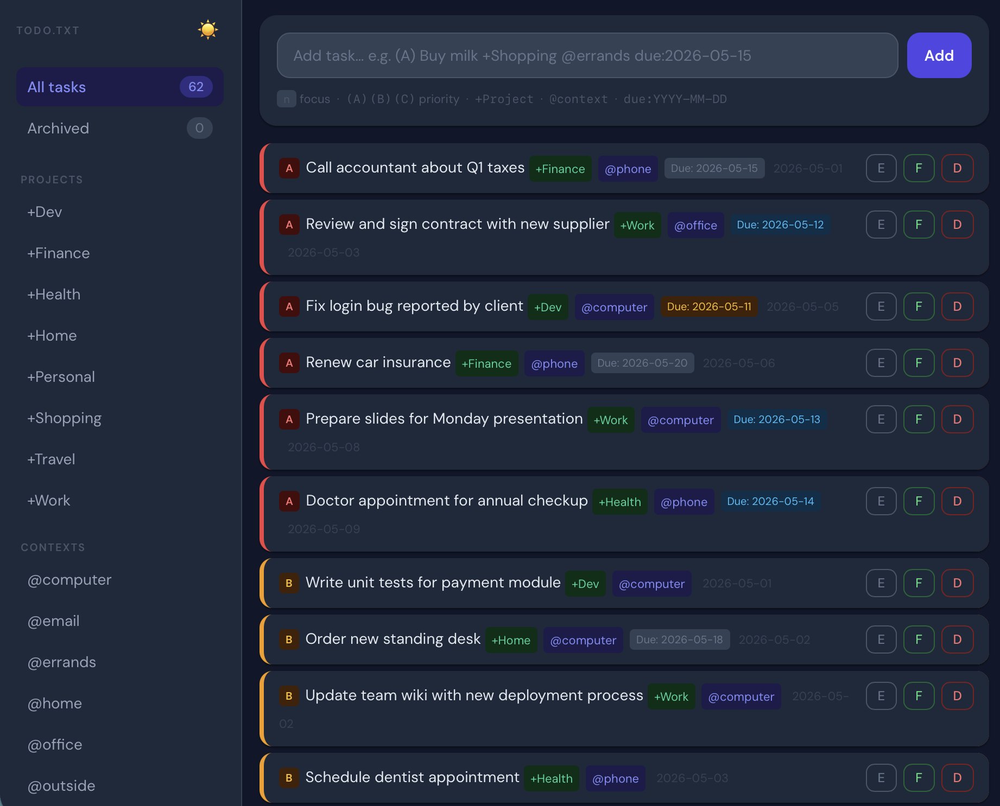

# tt-todo.txt

A minimal, single-file PHP frontend for the [todo.txt](http://todotxt.org) plain-text task format.



## Features

- **todo.txt format** — priorities `(A)`/`(B)`/`(C)`, creation dates, `+Projects`, `@contexts`, `due:` dates
- **Filter** by project or context — sidebar on desktop, scrollable chip bar on mobile
- **Due date badges** — overdue (red), today (amber), soon (blue), future (gray)
- **Edit tasks** inline via a slide-up modal
- **Archive** completed tasks to `done.txt` with one click
- **Done view** — browse archived tasks, restore or permanently delete them
- **Dark / light theme** — auto-switches at 20:00, manual toggle with ☀️ / 🌙
- **Mobile-friendly** — responsive layout, touch-optimized, no dependencies beyond Tailwind CDN
- **Single file** — everything in `index.php`, no build step, no framework

## Files

| File | Purpose |
|---|---|
| `index.php` | The entire application |
| `todo.txt` | Active tasks — read and written by the app |
| `done.txt` | Archived tasks — appended to when you archive completed tasks |

Both `todo.txt` and `done.txt` are created automatically if they don't exist. You can also seed them with your own data before uploading.

## Requirements

- PHP 8.0+ (tested on PHP 8.3)
- A writable directory for `todo.txt` and `done.txt`

## Installation

1. Upload `index.php` to any PHP-capable web server
2. Optionally place your `todo.txt` and/or `done.txt` in the same directory
3. Done — open the URL in a browser

## todo.txt format

```
(A) 2026-05-01 Call accountant +Finance @phone due:2026-05-15
(B) Fix login bug +Dev @computer
x 2026-05-10 2026-05-01 Completed task +Work @computer
```

| Token | Meaning |
|---|---|
| `(A)` | Priority — A, B, C |
| `2026-05-01` | Creation date |
| `+Project` | Project tag |
| `@context` | Context tag |
| `due:YYYY-MM-DD` | Due date |
| `x DATE` | Completed |

## Credits

Built by [tt-digital.de](https://tt-digital.de) · © 2026
